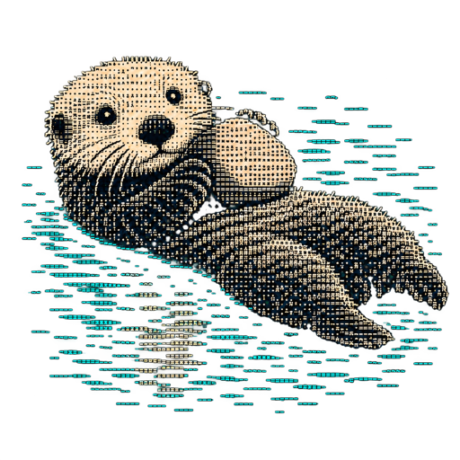

<div align="center">



# Botter

**A roster of named bots for your local Hermes agent.**

Native macOS app · local-first · no cloud · no telemetry

</div>

---

Instead of one catch-all assistant, you run a roster of named **Bots** — each with a job
("Sales Outbound", "Inbox Manager", "Expense Manager"), its own memory and working style,
scheduled routines, and an approval boundary. All of it is managed from a single chat-first
native app.

Botter is a local-first take on the multi-agent roster idea, built on top of the
[Nous Research `hermes-agent`](https://github.com/NousResearch/hermes-agent) installed on your
own machine at `~/.hermes`. You bring the agent and your own API keys; Botter gives you the
roster, the chat, the routines, and the approvals on top.

Two rules shape the whole design:

1. **One bot is one Hermes profile.** A bot is a real isolated agent instance at
   `~/.hermes/profiles/<slug>` with its own `config.yaml`, `SOUL.md`, memories, `state.db`,
   and cron jobs. Nothing is simulated.
2. **Hermes core is never patched.** Botter only touches config, profiles, and the HTTP API
   server Hermes already ships. `hermes update` stays safe forever.

---

## Architecture

Three components, one seam. The app knows exactly one origin and one auth scheme.

```
┌──────────────────────────────────────────────────────────────────────┐
│  Botter.app — SwiftUI, macOS 15+                                     │
│  sidebar roster · streaming chat · routines · approvals · settings   │
│  zero third-party dependencies · dark-only design system             │
└────────────────────────────────┬─────────────────────────────────────┘
                                 │  HTTP + SSE, bearer token
                                 │  http://127.0.0.1:8674/v1
                                 ▼
┌──────────────────────────────────────────────────────────────────────┐
│  botterd — Python 3.11 / FastAPI, launchd agent                      │
│                                                                      │
│   bot registry (SQLite ~/.botter/botter.db)                          │
│   profile lifecycle  → shells `hermes profile create --clone`        │
│   feed aggregation   → latest message + unread across all profiles   │
│   chat proxy         → Hermes SSE dialect → normalized SSE contract  │
│   routines           → Hermes cron jobs + execution ledger           │
│   approvals          → run events → pending queue → decision         │
│   credentials + MCP  → supervises a `hermes serve` child             │
│   events firehose    → one SSE stream the whole app subscribes to    │
└────────────────────────────────┬─────────────────────────────────────┘
                                 │  HTTP, bearer API_SERVER_KEY
                                 │  http://127.0.0.1:8642/p/<slug>/…
                                 ▼
┌──────────────────────────────────────────────────────────────────────┐
│  Hermes gateway — existing launchd service `ai.hermes.gateway`       │
│  api_server enabled · gateway.multiplex_profiles                     │
│  one process serves every profile · one profile per bot              │
└──────────────────────────────────────────────────────────────────────┘
```

**Why a companion service instead of the app talking to Hermes directly**

| Reason | Detail |
|---|---|
| Profile lifecycle is CLI-only | Create / clone / describe / delete must be shelled out on the Mac. |
| The sidebar needs an aggregate | "Latest message + unread per bot across N profiles" — no single Hermes endpoint provides it. |
| Presentation metadata has no home | Avatar color and glyph, display name vs. profile slug, archived state. |
| iOS later | Only `botterd` is ever exposed through a relay. Hermes stays loopback-only. |

**Trust model** — Hermes binds `127.0.0.1:8642` with a bearer `API_SERVER_KEY`. `botterd` binds
`127.0.0.1:8674` with a bearer token auto-minted at `~/.botter/token` (mode 0600). No inbound
ports are ever opened. Secrets are never logged, and credential values come back redacted.

---

## Current features

Everything in this section is implemented and live-verified.

### Roster and navigation

- Sidebar with 285 pt fixed column, otter avatar, bold name, relative timestamp, and a
  one-line preview of the latest message.
- Unread dots with server-side read state, so the count survives a relaunch — and will
  carry to iOS later.
- Live local filter as you type; press Enter to run a cross-session full-text search
  (Hermes FTS5) and get message results with snippets.
- Archived bots behind a disclosure. Archive hides, it never deletes.
- Keyboard navigation, VoiceOver labels, hover states.

### Chat

- Streaming replies over SSE with a live token caret and an elapsed timer.
- **One turn is one bubble.** Hermes writes an assistant row per interim narration step;
  `botterd` folds those into a single message with a collapsed trace above the answer.
- Task report cards — "Worked through N steps", each row `✓ label → detail`, with failed
  and still-running states distinguished.
- Thinking trace — "Thought for N seconds", expandable to per-tool steps.
- Rich block rendering: markdown prose, code cards with syntax highlighting and a copy
  button, real tables from pipe syntax, and charts from fenced ` ```chart ` JSON specs
  drawn with Swift Charts.
- Inline image attachments — one PNG / JPEG / GIF / WebP up to 5 MB, with signature
  validation and a removable preview before send.
- Stop button interrupts an active run. A dropped stream keeps its partial text.
- Day separators, gap-based timestamps, and a restrained 180 ms entrance animation.

### Bots

- Create and edit in a sheet: name, job title, description, approval boundary, an
  8-color palette, and 10 otter avatar poses.
- **34 starter roles** across 9 categories (Sales, Marketing, Support, Finance, Operations,
  Engineering, Research, People, Personal). Each fills in a full description and a sensible
  approval boundary.
- Creating a bot clones a Hermes profile, renders `SOUL.md` from the persona, provisions
  egress, and creates the default thread.
- Memory viewer — read-only render of the profile's `MEMORY.md` and `USER.md`.
- Delete runs the full six-step profile purge, behind a destructive confirmation.

### Routines

- Per-bot panel: status dot, schedule in plain English, last-run age, pause switch,
  and Run now.
- Editor with preset chips (Hourly / Daily 9am / Weekday mornings / Weekly Monday) plus a
  raw cron field with a live natural-language preview.
- Execution history read from the profile's cron ledger, projected into the bot's main
  thread as messages.

### Approvals

- Inline approval cards in chat — Approve / For this task / Always / Deny — that collapse
  to a badge once resolved.
- A pending pill in the sidebar, a Dock tile badge, and a system notification.
- Resolving from any surface reconciles everywhere over SSE.

### Credentials, integrations, and MCP

- A three-tab "Hermes" sheet: **Credentials**, **Apps**, **Config**.
- Full env-credential catalog (~130 keys) split into service credentials and plain config
  by a `kind` discriminator, so debug timeouts do not pollute the integrations list.
- Every write goes through Hermes' own credential lifecycle and fans out to **main plus every
  registered bot profile**, with rollback, drift detection, and out-of-sync indicators.
- In-app **Google OAuth** — the app drives the Hermes google-workspace skill, refreshes the
  bots' Docker sandboxes, and refuses to run while a chat is active.
- **MCP servers** — add, remove, and browser-based OAuth authorization, written
  comment-preservingly into every profile's `config.yaml`. Composio Connect ships as a preset.
- Infrastructure and Slack keys are protected and read-only by design.

### Platform and operations

- Settings window: botterd and Hermes health dots with versions, endpoint, token path, and
  launch-at-login via `SMAppService`.
- launchd install script with a health-poll gate and a port-conflict guard.
- A contract-identical **mock server** so the app can be developed with no Hermes running.
- A design token gallery (⌘⇧D) showing every color, glyph, type step, and message style.

---

## Planned

| Item | Phase | Notes |
|---|---|---|
| Group threads — bots passing work to each other | v2 | Cross-profile threads over the Hermes `a2a` toolset, with "Messages from ⬤ X and ⬤ Y" attribution rows. |
| Computer panel | v2 | Per-bot desktop: local Docker sandbox view first, then an on-demand cloud box with live preview and browser takeover. The header button already exists, disabled. Design in [`docs/PLAN_COMPUTER.md`](docs/PLAN_COMPUTER.md). |
| iOS app | v3 | BotterKit already builds for iOS 18. The app target does not exist yet, and some views still import AppKit directly. |
| Cloud relay | v3 | Cloudflare Tunnel plus an Access service token. `ClientConfiguration.extraHeaders` is already in place, so this is a URL-and-headers change. |
| Memory editing | v1.5 | The viewer ships today; editing does not. |
| Model override picker | v1.5 | Needs a `GET /v1/models` passthrough. |
| Document and PDF attachments | deferred | Blocked upstream — Hermes' session API accepts inline images but rejects file content parts. |
| "Created routine" chip deep-link | deferred | Should open the routines panel. |

**Known limitations**

- Cron-fired routines raise no approvable run in Hermes, so app-side approvals are guaranteed
  only for chats you start. Routine boundaries fall back to `SOUL.md` text plus
  `tool_loop_guardrails`.
- Hermes stores routine output without an execution ID, so a successful execution carries an
  empty summary rather than an invented join.
- Deleting a profile needs a gateway restart and sweep before the slug can be reused.
- Learning a routine by demonstration is out of scope. Hermes has no screen-watching trainer.
- Botter depends on Hermes behavior that is not a published, versioned API. It is verified
  against one Hermes version and warns rather than refusing on others. See
  [`docs/HERMES_COMPATIBILITY.md`](docs/HERMES_COMPATIBILITY.md).
- No signed release or `.dmg` yet — you build from source, and the build is ad-hoc signed.

---

## Getting started

There is no installer or `.dmg` yet — you build from source. Budget **about 45 minutes** if
you already have Xcode and a Hermes agent, or **about 2 hours from a cold start** (most of it
downloading Xcode).

[`docs/SETUP.md`](docs/SETUP.md) is the full guide, with troubleshooting for each step.

**Prerequisites**

| | | |
|---|---|---|
| macOS 15+ | | required |
| Xcode 16+ with Swift 6 | ~10 GB from the App Store | required |
| `xcodegen`, `uv` | `brew install xcodegen uv` | required |
| A Hermes agent at `~/.hermes` | step 1 below | required |
| An LLM provider API key | OpenRouter, xAI, or Nous Portal — with credit on it | required |
| Docker | agent sandboxing and egress enforcement | optional, recommended |

```bash
# 0. Build tools
brew install xcodegen uv

# 1. Get a Hermes agent — SKIP if you already have one.
#    `hermes setup` is where your own LLM API key goes; Botter never asks for it.
curl -fsSL https://hermes-agent.nousresearch.com/install.sh | bash
source ~/.zshrc                   # or ~/.bashrc
hermes setup
hermes chat                       # confirm Hermes works on its own before continuing

# 2. Get Botter
git clone https://github.com/treysweeney3/botter.git
cd botter

# 3. Prepare Hermes: enable api_server, multiplex profiles, fix the proxy allowlist
scripts/setup_hermes.sh           # backs up config.yaml and proxy.yaml first
scripts/verify_hermes.sh          # 22 checks, all must pass before continuing

# 4. Install botterd as a launchd agent (127.0.0.1:8674)
scripts/install_botterd.sh        # polls /v1/health for up to 30s

# 5. Build and launch the app
scripts/run_app.sh                # --clean wipes DerivedData, --no-launch builds only
```

Then open the **Hermes** sheet in the app to add credentials and authorize Composio, and
create your first bot.

Hermes installed elsewhere? Every script honors `HERMES_HOME`:
`HERMES_HOME=/path/to/.hermes scripts/setup_hermes.sh`

**If `botterd` never becomes healthy**, check `~/.botter/botterd.log`. The two most common
causes are Hermes having no default model (`hermes model`) and a missing `API_SERVER_KEY`
(re-run `scripts/setup_hermes.sh`). Both currently prevent `botterd` from starting at all
rather than reporting the problem — see [`docs/SETUP.md`](docs/SETUP.md) §6.

> **Botter modifies the Hermes agent it attaches to.** It edits `config.yaml` and
> `proxy.yaml` (backing both up), and credentials you save are written to your main
> profile as well as to each bot. See [`docs/SETUP.md`](docs/SETUP.md) §5 for the full
> list of what changes on your machine, and
> [`docs/DESIGN_CREDENTIAL_SCOPE.md`](docs/DESIGN_CREDENTIAL_SCOPE.md) for the plan to
> narrow that blast radius.

**Working on the app without Hermes** — the mock server is a contract-identical, in-memory
implementation of every route including both SSE streams. It is a development tool, not a
demo mode:

```bash
cd backend && uv run mock         # 127.0.0.1:8674, token "mock-token"
```

**Tests**

```bash
cd backend && uv run pytest -q    # contract, SSE, credentials, MCP, registry, routines, YAML
cd app/BotterKit && /usr/bin/swift test
scripts/e2e.sh                    # live end-to-end against the installed daemon
```

**Uninstall** — `scripts/uninstall_botterd.sh` boots out the launchd agent and leaves
`~/.botter` intact.

---

## API surface

`http://127.0.0.1:8674`, all routes under `/v1`, `Authorization: Bearer <token>`, JSON in
snake_case. Errors are `{"error": {"code", "message"}}`. `GET /v1/health` is the only public route.

| Group | Routes |
|---|---|
| Health | `GET /health` |
| Bots | `GET/POST /bots` · `GET/PATCH/DELETE /bots/{id}` · `GET /bots/{id}/memory` |
| Sessions | `GET/POST /bots/{id}/sessions` · `GET /sessions/{sid}/messages` · `POST /sessions/{sid}/read` · `POST /sessions/{sid}/stop` |
| Chat | `POST /sessions/{sid}/chat` — **SSE**: `delta`, `tool_event`, `approval_required`, `message_complete`, `error` |
| Routines | `GET/POST /bots/{id}/routines` · `PATCH/DELETE /routines/{rid}` · `POST /routines/{rid}/run\|pause\|resume` · `GET /routines/{rid}/executions` |
| Approvals | `GET /approvals` · `POST /approvals/{run_id}` |
| Events | `GET /events` — **SSE firehose**: `bot_updated`, `feed_updated`, `approval_pending`, `approval_resolved`, `routine_fired`, `integration_updated`, `mcp_updated` |
| Credentials | `GET /integrations` · `PUT/DELETE /integrations/{key}` · `POST/DELETE /auth/google` |
| MCP | `GET /mcp` · `PUT/DELETE /mcp/{name}` · `POST /mcp/{name}/authorize` · `GET /mcp/authorizations/{flow_id}` |
| Search | `GET /search?q=&bot_id=` |

The full pinned contract — envelopes, the normalized message schema, and both SSE payload
shapes — lives in [`docs/SPEC.md`](docs/SPEC.md) §4.

---

## Design language

Fixed dark theme, matching the reference product.

| Token | Value |
|---|---|
| Window / sidebar / card | `#0D0D0D` · `#161618` · `#1E1E20` |
| Text primary / secondary | `#ECECEC` · `#8A8A8E` |
| Hairline | `#2A2A2C` |
| User bubble | `#FFFFFF` with black text, right-aligned |
| Bot palette | teal `#2EC7A6` · orange `#E8833A` · purple `#8B5CF6` · blue `#3B82F6` · red `#EF4444` · green `#22C55E` · yellow `#EAB308` · pink `#EC4899` |
| Radii | bubbles 16 · cards 12 · composer and search full-pill |
| Type | system SF — 13 pt sidebar, 14 pt chat, 11 pt timestamps |

**No emoji anywhere in the UI.** Avatars, badges, and status marks are colored circles, vector
assets, and the ten bundled ASCII-mosaic otter poses — `float swim dive stand sprawl peek groom
shell wave raft`. Motion is restrained: 180 ms entrances, subtle hover, a blinking stream caret,
and Reduce Motion is honored.

---

## Repo layout

```
botter/
├── app/
│   ├── project.yml            # XcodeGen source of truth (the .xcodeproj is generated)
│   ├── Botter/                # macOS app target — views, sheets, app icon
│   └── BotterKit/             # SPM package: client, SSE parser, stores, models, design system
│                              # builds for macOS 15 + iOS 18, zero external dependencies
├── backend/
│   ├── botterd/               # FastAPI service — 20 modules, 36 routes
│   ├── mockserver/            # contract-identical in-memory fake for app development
│   ├── tests/                 # 12 pytest files
│   └── fixtures/              # captured Hermes SSE streams and Phase 0 transcripts
├── docs/                      # setup guide, spec, compatibility, design docs
└── scripts/                   # Hermes setup, botterd install, app build, e2e
```

`app/Botter.xcodeproj` is **generated** from `app/project.yml` by XcodeGen and is not tracked
in git. Run `xcodegen generate` (or `scripts/run_app.sh`, which does it for you) after adding,
renaming, or deleting a source file.

## Documents

| Doc | Purpose |
|---|---|
| [`docs/SETUP.md`](docs/SETUP.md) | Install guide — prerequisites, getting a Hermes agent, what Botter changes on your machine, troubleshooting |
| [`docs/SPEC.md`](docs/SPEC.md) | Product and system spec: concepts, architecture, pinned API contract, design language, phasing |
| [`backend/NOTES.md`](backend/NOTES.md) | Verified runtime findings about Hermes behavior — the most useful document here for a new contributor |
| [`docs/HERMES_COMPATIBILITY.md`](docs/HERMES_COMPATIBILITY.md) | The Hermes version Botter is tested against, and every upstream behavior it depends on |
| [`docs/DESIGN_CREDENTIAL_SCOPE.md`](docs/DESIGN_CREDENTIAL_SCOPE.md) | Open design question: the `main` profile's four roles and how to narrow Botter's write scope |
| [`docs/PLAN_COMPUTER.md`](docs/PLAN_COMPUTER.md) | Design for the Computer panel — per-bot cloud desktop, local sandbox view |
| [`docs/removed/`](docs/removed/) | Features removed on purpose, with restore instructions |

---

## Contributing

Contributions are welcome — bug fixes, features, and documentation.
Start with [`CONTRIBUTING.md`](CONTRIBUTING.md), which covers the development setup, the
checks CI runs, the DCO sign-off, and the architectural invariants a PR has to respect.

Security issues must **not** be filed as public issues — see [`SECURITY.md`](SECURITY.md),
which also documents the trust model and the deliberate decision to store credentials in
Hermes' plaintext `.env` format.

## License

[Apache License 2.0](LICENSE). See [`NOTICE`](NOTICE) for attribution.

Botter is an independent project. It manages a local Hermes agent through that agent's own
configuration and HTTP API, and includes no Hermes source code. Not affiliated with or
endorsed by Nous Research, xAI, Composio, or any other organization whose services it can be
configured to connect to.
</content>
